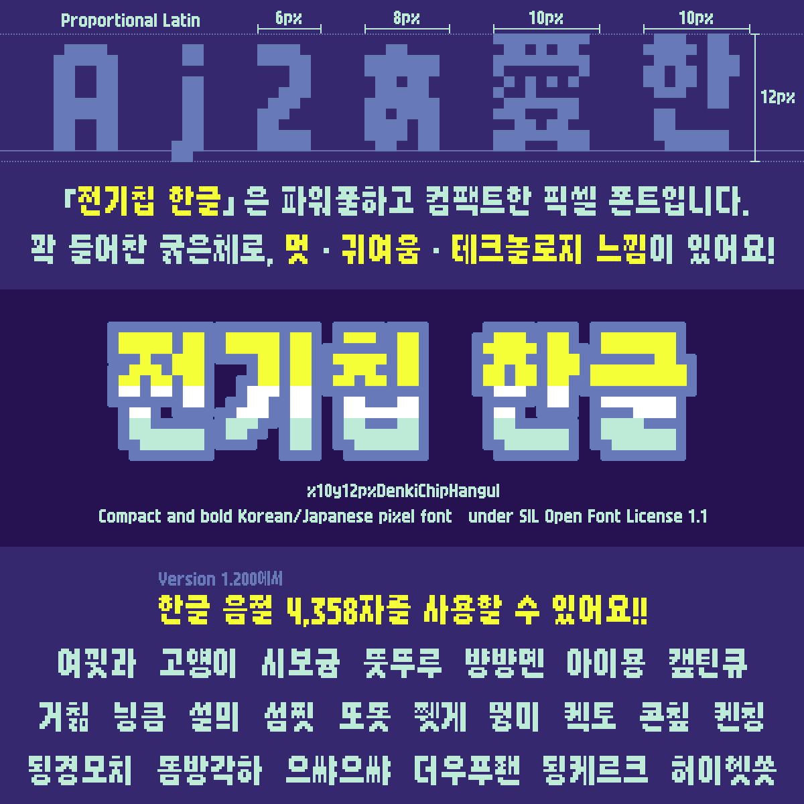

# x10y12pxDenkiChipHangul (전기칩 한글)



x10y12pxDenkiChipHangul is a 12-pixel Korean and Japanese pixel typeface. It extends [x8y12pxDenkiChip (でんきチップ)](https://github.com/hicchicc/x8y12pxDenkiChip), the Japanese pixel typeface designed by [hicc (患者長ひっく)](https://x.com/hicchicc), with Hangul and additional characters for Korean text. The project is intended for games, user interfaces, web pages, and other settings that benefit from crisp, compact pixel lettering.

Except for Hangul and the other newly added characters, the glyph shapes inherited from x8y12pxDenkiChip are preserved unchanged. See the [live demo](https://blog.quiple.dev/font/denkichip-hangul) for an interactive specimen.

## Language and character support

The font includes Latin, Hangul, Hiragana, Katakana, punctuation, symbols, and a selection of CJK unified ideographs. Its Korean repertoire contains 4,358 Hangul syllables from Adobe-KR-0 and Adobe-KR-1, and it also includes 640 kanji used in Japanese text.

## Building

The build currently requires macOS because it uses Glyphs 3 and the Glyphs command-line tool.

Install the following prerequisites:

- Glyphs 3.5 or later with a valid license
- The `BDF` plug-in from the modified [`quiple/BDFFileFormat`](https://github.com/quiple/BDFFileFormat) repository, installed in Glyphs 3
- Python 3.10 or later
- Make

Create the project-specific Python environment and install the pinned dependencies:

```sh
make setup
```

Build all font formats from the repository root:

```sh
make
```

The Google Fonts-style single-command build entry point is also available:

```sh
./sources/build.sh
```

The build generates the following files:

- `fonts/otf/x10y12pxDenkiChipHangul.otf`
- `fonts/ttf/x10y12pxDenkiChipHangul.ttf`
- `fonts/webfonts/x10y12pxDenkiChipHangul.woff2`
- `fonts/bdf/x10y12pxDenkiChipHangul.bdf`

Overlap removal is enabled and automatic hinting is disabled for OTF, TTF, and WOFF2 exports. After the outline TTF is generated, fontTools embeds integer-scaled 1-bit `EBDT`/`EBLC` bitmap strikes at 12, 24, 36, 48, and 60 pixels per em.

If Glyphs is installed somewhere other than `/Applications/Glyphs 3.app`, specify its location when building:

```sh
make GLYPHS_APP="/path/to/Glyphs 3.app"
```

Remove generated font files with:

```sh
make clean
```

## License

Copyright 2026 Lee Minseo (`quiple@quiple.dev`).

Copyright 2026 The x8y12pxDenkiChip Project Authors ([github.com/hicchicc/x8y12pxDenkiChip](https://github.com/hicchicc/x8y12pxDenkiChip)).

This Font Software is licensed under the SIL Open Font License, Version 1.1. The license is included in this repository as [`OFL.txt`](./OFL.txt) and is also available with a FAQ at [openfontlicense.org](https://openfontlicense.org/).

## Credits

- [hicc (患者長ひっく)](https://x.com/hicchicc) and the [x8y12pxDenkiChip project authors](https://github.com/hicchicc/x8y12pxDenkiChip) — original x8y12pxDenkiChip design
- [Lee Minseo (quiple)](https://quiple.dev) (quiple@quiple.dev) — Korean extension, additional glyph design, font engineering, and project maintenance

The official copyright authors and project contributors are also listed in [`AUTHORS.txt`](./AUTHORS.txt) and [`CONTRIBUTORS.txt`](./CONTRIBUTORS.txt).
